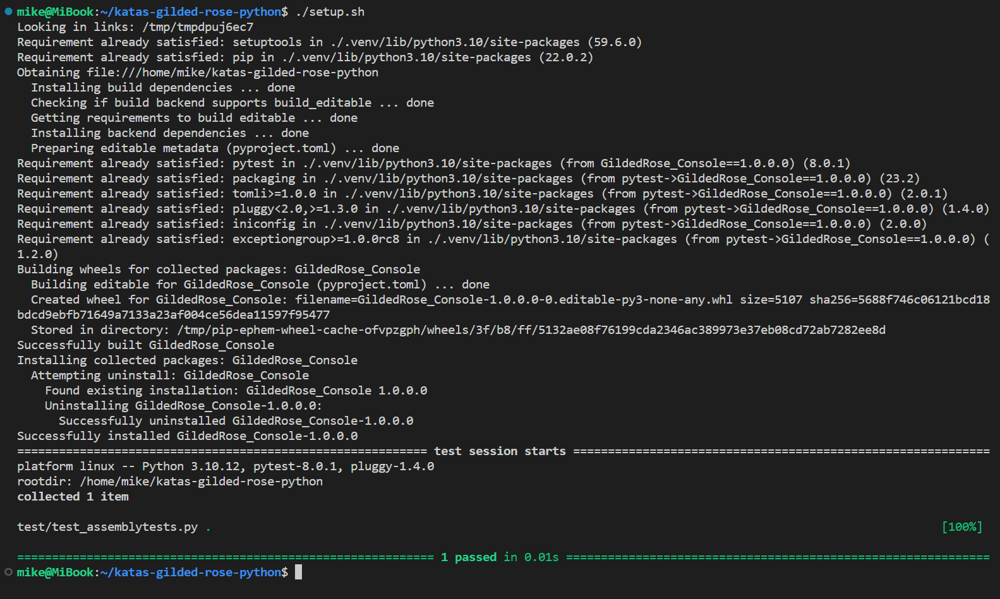

# Gilded Rose Refactoring Kata

Hi and welcome to team Gilded Rose. As you know, we are a small inn with a 
prime location in a prominent city ran by a friendly innkeeper named 
Allison. We also buy and sell only the finest goods. Unfortunately, our 
goods are constantly degrading in quality as they approach their sell by 
date. We have a system in place that updates our inventory for us. It was 
developed by a no-nonsense type named Leeroy, who has moved on to new 
adventures. Your task is to add the new feature to our system so that we 
can begin selling a new category of items. First an introduction to our 
system:

- All items have a SellIn value which denotes the number of days we have 
to sell the item
- All items have a Quality value which denotes how valuable the item is
- At the end of each day our system lowers both values for every item

Pretty simple, right? Well this is where it gets interesting:

- Once the sell by date has passed, Quality degrades twice as fast
- The Quality of an item is never negative
- "Aged Brie" actually increases in Quality the older it gets
- The Quality of an item is never more than 50
- "Sulfuras", being a legendary item, never has to be sold or decreases 
in Quality
- "Backstage passes", like aged brie, increases in Quality as it's SellIn 
value approaches; Quality increases by 2 when there are 10 days or less 
and by 3 when there are 5 days or less but Quality drops to 0 after the 
concert

We have recently signed a supplier of conjured items. This requires an 
update to our system:

- "Conjured" items degrade in Quality twice as fast as normal items

Feel free to make any changes to the UpdateQuality method and add any 
new code as long as everything still works correctly. However, do not 
alter the Item class or Items property as those belong to the goblin 
in the corner who will insta-rage and one-shot you as he doesn't 
believe in shared code ownership (you can make the UpdateQuality 
method and Items property static if you like, we'll cover for you).

Just for clarification, an item can never have its Quality increase 
above 50, however "Sulfuras" is a legendary item and as such its 
Quality is 80 and it never alters.

## Getting Started

1. "Use this template" to create a new repo. ([Here's how](https://docs.github.com/en/repositories/creating-and-managing-repositories/creating-a-repository-from-a-template#creating-a-repository-from-a-template))
1. Run `./setup.sh`. If you see  output similar to the following screenshot, you are ready to  start refactoring.

    

## Who, What, Why?

### Originally

- **Who:** [@TerryHughes](https://twitter.com/TerryHughes), [@NotMyself](https://twitter.com/NotMyself)

- **What & Why:** [Refactor This: The Gilded Rose Kata](http://iamnotmyself.com/2011/02/13/refactor-this-the-gilded-rose-kata/)

- The repository can be found at [https://github.com/NotMyself/GildedRose](https://github.com/NotMyself/GildedRose)

### Additional thanks to

- [Adrianlm17](https://github.com/Adrianlm17) for the awesome picture at the top
- [emilybache](https://github.com/emilybache) for the initial port to python

### Me

#### Who:
- [MusicalNinjaRandInt - Github](https://github.com/MusicalNinjaRandInt/MusicalNinjaRandInt)
- [Mike Foster - LinkedIn](https://www.linkedin.com/in/mjfoster/)

#### What:

1. Take small steps when refactoring, don't break anything at any time (you'll probably need tests for that), aim to finish with a codebase which you are proud of and a commit history which is long ...

1. Don't be afraid to add any Infra-as-Code that you want. I deliberately left it out for reasons of purity and realism.

1. Think about semantic versioning

1. Don't anger the goblin in the corner!

#### Why:

I find something satisfying about refactoring, I love the constant green lights in TDD.

I spend a lot of my professional time coaching technical people and helping to change the organisations they work in to better support them. Kata's like this are the equivalent of the drills that a good sports coachs runs through with the team in training; and a good sports coach also enjoys playing, not just coaching.

I looked around and loved the port by [emilybache](https://github.com/emilybache) but felt that I missed the purity of the starting position from [the original](https://github.com/NotMyself/GildedRose). I understand Terry's view that *any* port misses the big picture of "jumping in to a new language and codebase" which very certainly *is* possible with this kata; at the same time I felt that offering the chance to do this in a language of choice opens up the possibility to learn a new language other than C# (maybe someone gets into python by creating the most pythonic version of the Gilded Rose), and makes this accesible to those not yet willing to take the jump to do this in a language they don't know.

## Contributing

- If you see something you think could be "better" (= closer to the original), please raise a PR or an issue.
- Anyone who can realistically assess the "quality" of [the original build.bat](https://github.com/NotMyself/GildedRose/blob/86bef008181ec580b207bef61163c9abfea4aa70/build.bat) is very, very welcome to make suggestiosn to "improve" `setup.sh`
- If you feel motivated to make a similar port in another language, please let me know and we can link to each other.

## License

MIT